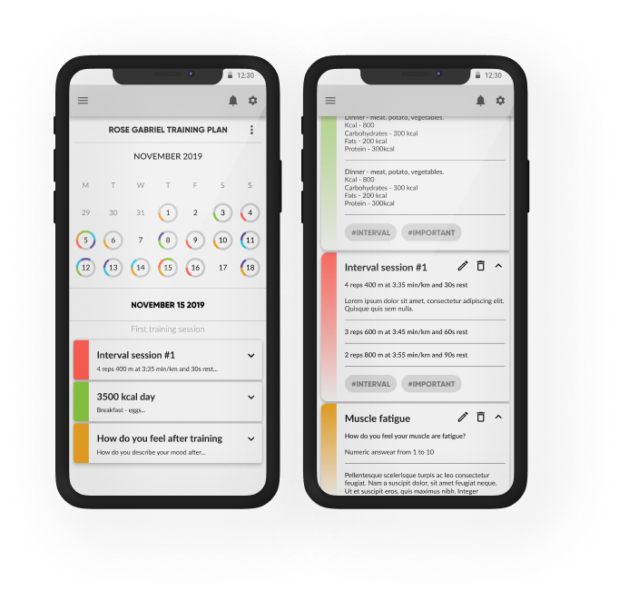

# Sport App

### Application for coaching athletes

## Link to app

[sport app](https://goofy-elion-e84290.netlify.app/)

## General Info

Application to create training and nutrition plans. Analysis of data collected from training. Creating a board with notes.

## Tech info

This code is a refactored application from [this repository](https://github.com/michalgrzegor/sport-app).

- The sports app is written in **Angular 10**.
- The legacy code used libraries like **moment.js**, **lodash.js**, **highcharts.js**. Authentication and authorization were implemented using **auth0.js**.
- In the refactored application, I used **date-fns.js** to manage all dates.
- I used the **redux** (**ngrx**) library to manage the state of the application.
- Authentication and authorization were implemented based on the **OAuth 2.0** protocol using
  the **Authorization Code Grant** flow.
- An **access token** is stored in an ngrx store and when refreshing the page or when an access token
  expires, **a refresh token** allows the application to obtain a new access token.
- **Angular SDK** helped me create **drag and drop** functionality.
- The project uses **BEM methodology** to name CSS classes.
- I used the **RxJS** library to handle asynchronous events.

## Technologies and libraries

- angular 10
- ngrx
- OAuth 2.0
- date-fns.js
- SASS
- methodology BEM
- RxJS
- ESLint

## Link to REST API

[rest api](https://github.com/matigrzegor/sport-api)
